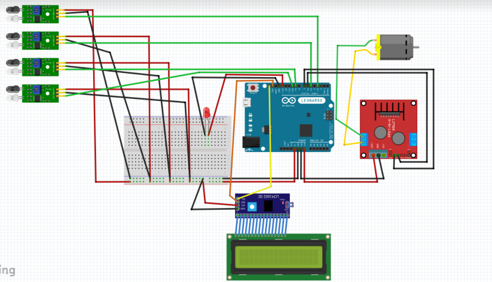
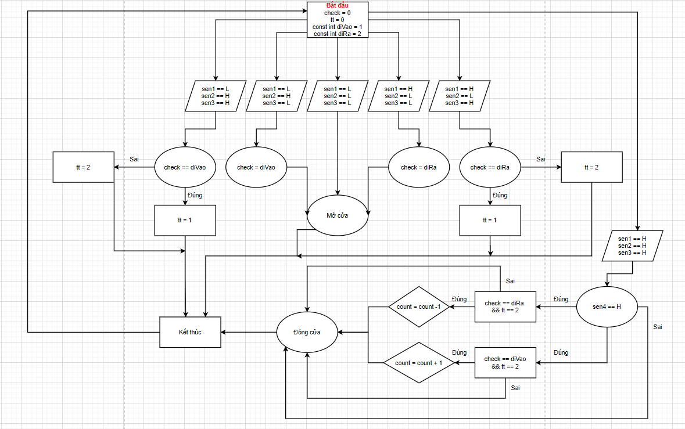

# HDAutomaticDoor
Lần đầu làm việc với Arduino và 1 hệ thống đo lường và điều khiển số, dù còn nhiều bỡ ngỡ nhưng nhóm đã đạt được nhiều thứ: 
- Tìm, chọn mua linh kiện cần thiết
- Lọc nhiễu cảm biến thủ công
- Biết viết bản mô tả đơn giản về 1 hệ thống đo lường và điều khiển số
- Làm việc theo đúng kế hoạch của mỗi giai đoạn trong dự án đã đặt ra
- Sử dụng các kiến thức từ các môn học cơ sở để thiết kế 1 hệ thống đo lường và điều khiển số
Mô phỏng:

Lưu đồ thuật toán: 
